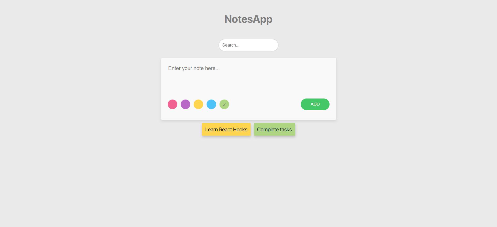
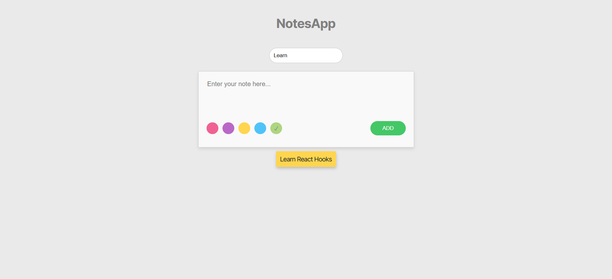

# Notes App

**Description**

The **Notes App** allows users to create, store, and manage notes easily.
Users can write their notes in a text area, choose a color for each note, and filter existing notes based on the content.

*Features*

Create Notes: Users can write notes in a text area and save them.
Color Selection: When adding a new note, users can select a color, which will be reflected in the note's background.
Color Preview: The selected color is displayed in real-time before saving the note.
Search Functionality: Users can filter previously saved notes using a search input.
Technologies Used
React: A JavaScript library for building user interfaces.
CSS: For styling the application.

*How to Run the Project*

1. Clone the repository:
    git clone https://github.com/elfdrkn/NoteApp-React
   Navigate to the project directory:
    cd notes-app
2. Install dependencies:
    npm install
3. Start the application:
    npm start

*Usage*

Enter your note in the text area.
Select a color for your note using the color picker.
Click the "ADD" button to save your note.
Use the search bar to filter your notes.

*Screenshots*

Here is a screenshot of the Notes App:

